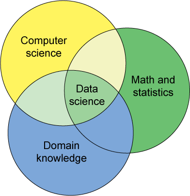

<style>
h2 { 
 color: #3399ff;		
}
h3 { 
 color: #3399ff;		
}
slides > slide.backdrop {
  background: white;
}
</style>


```{r setup, include=FALSE}
knitr::opts_chunk$set(echo = FALSE)
```


## What is Data Science?

From a [presentation](http://bulletin.imstat.org/2014/10/ims-presidential-address-let-us-own-data-science/) by former Institute of Mathematical Statistics president Bin Yu:




## What is Data Science?

More refined Venn Diagram by Drew Conway:


## Data Pipeline

How does one answer a scientific question with data? Leek & Peng in Nature (2015)
illustrate the [data pipeline](http://www.nature.com/news/statistics-p-values-are-just-the-tip-of-the-iceberg-1.17412#/pipe)

1. Data collection
2. Data cleaning
3. Exploratory data analysis
4. Statistical modelling
5. Inference (form conclusions and communicate them)

Intro stats classes focus a bit on 3, 4, and 5 partially. This class will try to cover *all* aspects of the pipeline.


## Goals for This Class

* Follow the complete statistical analysis cycle
* Real data: more interesting, not clean, violating statistical assumptions
* Data visualization: not just infographics, but as an analytical tool
* Use computational tools: R coding, R packages, scraping data from the web, building web apps
* Apply statistical methodologies: regression, correlated data, spatial statistics, text mining, etc.


## Process

* Teach in a [language agnostic](http://programmers.stackexchange.com/questions/28484/what-is-language-agnosticism-and-why-is-it-called-that-way) way. Transferable and generalizable ideas, not a class on R.
* Not learn a programming language, but learn how to learn a programming language
    + By doing
    + Google is your best friend
    + By suffering, like learning any other language


## Cliche: Working Smarter, Not Harder

* [Don't thrash](http://giphy.com/embed/KrTzeQI0mq4P6). Really!
* Don’t be stuck for more than 20 minutes. This takes self-awareness and mindfulness.
* Seek expert advice; You’ll be on the other side soon enough
    + Your peers.
    + Me. Note I do prefer speaking in person than email.


## Building Our Data Toolbox


## Building Our Data Toolbox

For the first part of the class, we emphasize the two most important tools:

* Tools for **manipulating/wrangling** your data: [`dplyr`](https://cran.rstudio.com/web/packages/dplyr/vignettes/introduction.html) package
* Tools for **visualizing data**: [`ggplot2`](http://ggplot2.org/) package, which is an implementation of the [Grammar of Graphics](http://vita.had.co.nz/papers/layered-grammar.html)

The beauty of these two R packages is there deep philosophy underlying their implementations.


