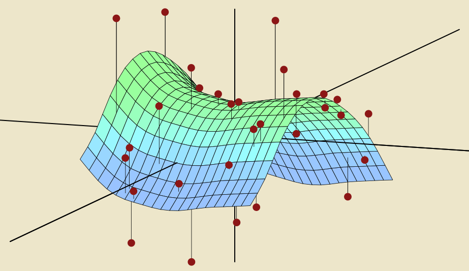

# Lectures

Lectures will be a combination of chalk talks and <a target="_blank" class="page-link" href="{{ site.baseurl }}/slides.html">a running slide deck</a>, the latter being also available in

* <a target="_blank" class="page-link" href="{{ site.baseurl }}/notes.html">HTML</a> format
* <a target="_blank" class="page-link" href="https://github.com/rudeboybert/MATH218/blob/gh-pages/slides.Rmd">R Markdown format</a> (click on "Raw" button and save to `.Rmd` format) and <a target="_blank" class="page-link" href="https://github.com/rudeboybert/MATH218/blob/gh-pages/slides.R">R source code format</a>.

## 2. Continuous Outcome Models

* **Lec08 - Fri 3/3**:
* **Lec07 - Wed 3/1**: Regression Part III
    + Go over <a href="{{ site.baseurl }}/assets/intro_splines.R" target="_blank">`intro_splines.R`</a>.
* **Lec06 - Mon 2/27**: Regression Part II
    + Go over <a href="{{ site.baseurl }}/assets/Chapter3_Lab.Rmd" target="_blank">`Chapter3_Lab.Rmd`</a>, everything up to and including the exercises at the end of 3.6.2.
* **Lec05 - Fri 2/24**: Regression

## 1. Introduction

* **Lec04 - Wed 2/22**: Intro to Cross-Validation & Formalization of Model/Score
* **Lec03 - Mon 2/20**: Resampling for Prediction
    1. Resampling to mimic the creation of `train` (to train model) and `test` (to evaluate/score/validate model)
* **Lec02 - Wed 2/15**: Toolbox
    1. `R`: `tidyverse` and the pipe operator `%>%`=
    1. DataCamp
    1. Kaggle: Supervised learning paradigm as embodied in Kaggle competitions.
* **Lec01 - Mon 2/13**: Introduction
    + Follow all steps in [Getting Started]({{ site.baseurl }}/getting_started/)
    + What is statistical/machine learning?

<!--
### 5. Text Data

<ul>
  
    {% assign current_date = post.date | date: "%m %d" %}
    
    <li>
      {{ post.date | date: "%a %b %-d" }} -  
      <a href="{{ post.url | prepend: site.baseurl }}">{{ post.title }}</a>:
      {{ post.subtitle }}
    </li>
    
  
</ul>  

### 4. Maps and Spatial Data

<ul>
  
    {% assign current_date = post.date | date: "%m %d" %}
    
    <li>
      {{ post.date | date: "%a %b %-d" }} -  
      <a href="{{ post.url | prepend: site.baseurl }}">{{ post.title }}</a>:
      {{ post.subtitle }}
    </li>
    
  
</ul>  

### 3. Dates and Times

<ul>
  
    {% assign current_date = post.date | date: "%m %d" %}
    
    <li>
      {{ post.date | date: "%a %b %-d" }} -  
      <a href="{{ post.url | prepend: site.baseurl }}">{{ post.title }}</a>:
      {{ post.subtitle }}
    </li>
    
  
</ul>  

### 2. Regression

<ul>
  
    {% assign current_date = post.date | date: "%m %d" %}
    
    <li>
      {{ post.date | date: "%a %b %-d" }} -  
      <a href="{{ post.url | prepend: site.baseurl }}">{{ post.title }}</a>:
      {{ post.subtitle }}
    </li>
    
  
</ul>  

### 1. Data Manipulation and Data Visualization

<ul>
  
    {% assign current_date = post.date | date: "%m %d" %}
    
    <li>
      {{ post.date | date: "%a %b %-d" }} -  
      <a href="{{ post.url | prepend: site.baseurl }}">{{ post.title }}</a>:
      {{ post.subtitle }}
    </li>
    
  
</ul>  
-->
