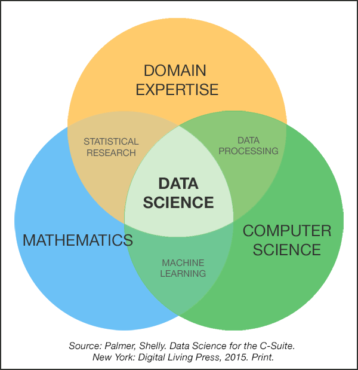

<style>
h1{font-weight: bold;}
h2{color: #3399ff;}
h3{color: #3399ff;}
slides > slide.backdrop {background: white;}
</style>

<style type="text/css">
slides > slide:not(.nobackground):after {
  content: '';
}
</style>


```{r setup, include=FALSE}
knitr::opts_chunk$set(echo = TRUE)
set.seed(76)
if(FALSE){
  rmarkdown::render("slides.Rmd", output_format = c("html_document"))
  knitr::purl("slides.Rmd", documentation = 2)
}
```


<!----------------------------------------------------------------------------->
# Lec03 - Mon 2/15:

## Score

> * We submitted the following model to Kaggle: Predict
  `Survived <- ifelse(Sex == "female, 1, 0)`
> * We got a [score](https://www.kaggle.com/c/titanic/leaderboard) (in this case "Categorization Accuracy" AKA proportion correct) of 0.76555.

$$Score = \frac{1}{n}\sum_{i=1}^{n}I(y_i = \widehat{y}_i)$$
where

> * $I(y_i = \widehat{y}_i) = 1$ if $y_i = \widehat{y}_i$
> * $I(y_i = \widehat{y}_i) = 0$ if $y_i \neq \widehat{y}_i$


## Titanic Data

* Kaggle split the original complete passenger data into
    + `train` data (891 rows): used by you to train model
    + `test` data (418 rows): used by Kaggle to evaluate/score/validate model
* However, the [Evaluation](https://www.kaggle.com/c/titanic#evaluation) indicates they further randomly split into
    + 50% (209 rows): used by Kaggle compute your leaderboard score
    + 50% (209 rows): used by Kaggle **only at the end** to determine the ultimate winner
* This was done to prevent "overfitting" to the leaderboard: i.e. trying to game the leaderboard


## Question of the Day

* Kaggle limits to 10 entries per day i.e. 10 score computations
* What if we want to train models and compute scores for ourselves more often?
* However, we need true outcomes $y_i$ to compute the score, which `test` doesn't have


## Solution

* Create `pseudo-train` and `pseudo-test` sets via **resampling** from `train` 
* Compute pseudo-scores by applying your model to `pseudo-test`


## Resampling

<center></center>


## Example:

Create disjoint `pseudo_train` and `pseudo_test` data sets using `dplyr::anti_join` 

```{r, message=FALSE}
library(tidyverse)
# You may need to change your directory path:
train <- readr::read_csv("assets/Titanic/train.csv")

pseudo_train <- train %>% 
  sample_frac(0.8)
pseudo_test <- train %>% 
  anti_join(pseudo_train, by="PassengerId")
```

See RStudio Menu Bar -> Help -> Cheatsheets -> Data Manipulation.


## Resampling

Compute your pseudo-score

```{r, message=FALSE}
pseudo_test %>% 
  # Create new column of predictions:
  mutate(Survived_predicted = ifelse(Sex == "female", 1, 0)) %>% 
  # Compute score:
  summarize(Score = mean(Survived == Survived_predicted))
```

Compare this to Kaggle score of 0.76555. Why are they different?


## Resampling

> * They are different b/c of sampling variability. Both at sampling and resampling stages!
> * Let's repeat the above 10 times and get 10 pseudo-scores:

```{r, message=FALSE, echo=FALSE}
simulated_accuracy <- rep(0, 10)
for(i in 1:length(simulated_accuracy)){
  pseudo_train <- train %>% 
    sample_frac(0.8)
  pseudo_test <- train %>% 
    anti_join(pseudo_train, by="PassengerId")
  
  simulated_accuracy[i] <- pseudo_test %>% 
    mutate(Survived_predicted = as.numeric(Sex == "female")) %>% 
    summarize(Score = mean(Survived == Survived_predicted)) %>% 
    .[["Score"]]
}
simulated_accuracy %>% round(3)
```

In this case, we have variability due to the resampling. The average of the 10 scores is `r simulated_accuracy %>% mean() %>% round(3)`


<!----------------------------------------------------------------------------->
# Lec02 - Wed 2/15: 

## Toolbox

1. `R`: `tidyverse` and the pipe operator `%>%`
1. DataCamp
1. Kaggle


## Tool 1: `tidyverse`

`tidyverse` is a set of packages that work in harmony because they share common data representations and API design. 

```{r, eval=FALSE}
install.packages("tidyverse")
library(tidyverse)
```

Read more on [RStudio's Blog](https://blog.rstudio.org/2016/09/15/tidyverse-1-0-0/).


## `tidyverse` Core Packages

These get loaded when you run `library(tidyverse)`

> * `ggplot2` for data visualisation.
> * `dplyr` for data manipulation.
> * `tidyr` for data tidying.
> * `readr` for data import.
> * `purrr` for functional programming.
> * `tibble` for tibbles, a modern re-imagining of data frames.


## `tidyverse` Non-Core Packages

These get installed with `tidyverse`

> * `hms` for times.
> * `stringr` for strings.
> * `lubridate` for date/times.
> * `forcats` for factors.


## `tidyverse` Data Import Packages

These get installed with `tidyverse`

> * `DBI` for databases.
> * `haven` for SPSS, SAS and Stata files.
> * `httr` for web apis.
> * `jsonlite` for JSON.
> * `readxl` for .xls and .xlsx files.
> * `rvest` for web scraping.
> * `xml2` for XML.


## `tidyverse` Modelling Packages

These get installed with `tidyverse`

> * `modelr` for simple modelling within a pipeline
> * `broom` for turning models into tidy data


## Tool 2: DataCamp

* Browser-based interactive tool for learning R/python
* Interface is like RStudio: wrapper around R console
* You all have access to [ALL courses](https://www.datacamp.com/courses/) for free for the semester!


## DataCamp 

If you are new to...

* `ggplot2`: Package for Data Visualization, do Data Visualization with ggplot2 [(Part 1)](https://www.datacamp.com/courses/data-visualization-with-ggplot2-1), [(Part 2)](https://www.datacamp.com/courses/data-visualization-with-ggplot2-2), and [(Part 3)](https://www.datacamp.com/courses/data-visualization-with-ggplot2-part-3)
* `dplyr`: Package for Data Manipulation, do [Data Manipulation in R with dplyr](https://www.datacamp.com/courses/dplyr-data-manipulation-r-tutorial) and [Joining Data in R with dplyr](https://www.datacamp.com/courses/joining-data-in-r-with-dplyr).
* R Markdown: Creating reproducible reports do [Reporting with R Markdown](https://www.datacamp.com/courses/reporting-with-r-markdown)


## Tool 3: Kaggle

* Baby's first Kaggle competition entry!
* Tutorial on their most popular competition for beginners [Titanic: Machine Learning from Disaster](https://www.kaggle.com/c/titanic).


## Titanic Data

For $i=1,\ldots,n$ passengers

* ID variable: `PassengerId`
* Outcome variable $y_i$: `Survived` (binary)
* 10 Predictors/covariates $\vec{X}_i$ i.e. information about the passenger: `Pclass`, `Name`, `Sex`, `Age`, `SibSp`, `Parch`, `Ticket`, `Fare`, `Cabin`, `Embarked`. 


## Models for Predicting Survival:

Naïve models: Use no information about the passenger, i.e. no covariates

1. Everyone dies: Predict
    + `Survived == 0`
1. Everyone lives: Predict
    + `Survived == 1`
1. Flip a weighted coin. Predict
    + `Survived == 1` with probability $p$
    + `Survived == 0` with probability $1-p$


## Models for Predicting Survival:

* Instead, let's use some information about the passengers: `Sex`? 
* Our model: Predict:
    + `Survived == 1` if `Sex == "female"`
    + `Survived == 0` if `Sex == "male"`


## Outline of Competition

Chalk talk i.e. see your lecture notes. 


## Titanic Data

Load CSV's into R:

```{r, message=FALSE}
library(tidyverse)
gender_submission <- readr::read_csv("assets/Titanic/gender_submission.csv")
test <- readr::read_csv("assets/Titanic/test.csv")
train <- readr::read_csv("assets/Titanic/train.csv")
```

* You may need to change your directory path.
* `readr::` just indicates the function is from the `readr` package. Use for disambiguation.


## Training Set

The binary outcome varible `Survived` is included.

```{r}
glimpse(train)
```


## Test Set

`Survived` is now **NOT** included. There are 418 rows (passengers) you need to predict.

```{r}
glimpse(test)
```


## Submission Example

This is what you submit: 418 rows with

> * the ID variable `PassengerId`
> * your **predicted** outcome variable `Survived`

```{r}
glimpse(gender_submission)
```


## Submission Example

You can write to CSV via:

```{r, eval=FALSE}
gender_submission %>% readr::write_csv("assets/Titanic/submission.csv")
```


## Submission Example

After submitting to Kaggle, you can see your ranking.


<!----------------------------------------------------------------------------->
# Lec01 - Mon 2/13: Introduction

## What is statistical/machine learning?

<center></center>


## What is statistical/machine learning?

* In Feb 2016, I agonized over title of course: "Statistical Learning" vs "Machine Learning"
* In Summer 2016: Ben Baumer at Smith posed:
* *"Instead of obsessing over Venn diagrams of what topics are within the domains of which disciplines, I ask instead..."*
* *"... What if we blew up math, stats, CS, and all their legacies and started over? What would this field look like?"*
* New moniker: Machine learning... taught from a statistician's perspective


## Definitions

* Arthur Samuel (1959): Machine learning is the subfield of computer science that gives computers the ability to learn without being explicitly programmed.
* Me: Prediction


## Examples:

* [Self-Driving Vehicles](https://www.wired.com/2016/10/ubers-self-driving-truck-makes-first-delivery-50000-beers/)
* Netflix recommendations
* Simple linear regression


## Background

* In the past, lots and lots of mathmatical science pre-requisites: algorithms, probability, linear algebra, etc.
* Brought to you from folks at Stanford in 2001: <center></center>


## Unchartered Territory

* New model: flatter pre-requisite structure. That means we'll have a few digressions for probability, linear algebra, etc.
* Brought to you from folks at Stanford (again) in 2013: <center></center>


## Unchartered Territory

* Book is still much like beta version of software:
     + New, exciting, and cutting edge but...
     + Lots bugs
* Battle tested with: <center></center>
* Smith College SDS Initiative <https://github.com/SmithCollege-SDS/tidy-islr>


## Toolbox

<center></center>


* [R vs Python](https://www.google.com/search?q=r+vs+python). A hammer vs a screwdriver
* Argument for R: Wickham's [Tidy tools manifesto](https://cran.r-project.org/web/packages/tidyverse/vignettes/manifesto.html)
    + Reuse existing data structures: Consistency across packages e.g. `ggplot2`, `dplyr`, `modelr`
    + Design for humans: Bottleneck in most data analysis is thinking time, not computing time. i.e. avoid **premature optimization**
    


## Cornerstone of Course

Final Project: Kaggle (rhymes with haggle)
[competition](https://www.kaggle.com/competitions).
    
    


## Sampling

<center></center>
    


## Resampling

<center></center>


